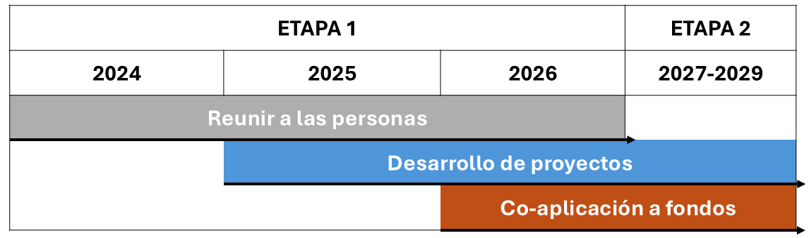
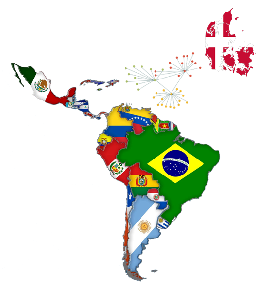

La primer etapa del proyecto de internacionalización está planeada para
implementarse en el transcurso de tres años: 2024-2026. Cada año
representa una fase del proyecto, con objetivos independientes y
actividades alineadas a ellos.

{fig-align="left"}

## Reunir a la gente

Esta fase del proyecto consiste en la realización de seminarios en línea
con el objetivo principal de crear y fortalecer la red SDCA-LATAM.
Además, queremos conocer y diseminar el tipo de investigación en
diabetes que se lleva a cabo en la región de América Latina, identificar
áreas potenciales de colaboración y conocer los intereses y necesidades
de investigación en diabetes en la región.

Desde la primavera de 2024 se han organizado estos seminarios de manera
mensual e involucrado a colegas con una gama de pérfiles diversos que se
encuentran en diferentes etapas de su trayectoría académica o clínica.
Gracias a la contribución de presentadores de diferentes países en la
región, incluyendo Argentina, México, Perú, Colombia, Costa Rica y
Brasil, estamos construyendo puentes al mismo tiempo que diseminamos el
conocimiento que se produce de manera local.

{fig-align="center"}

Accede a las presentaciones y las grabaciones en la pestaña de
seminarios.

## Desarrollo de proyectos

Conforme la red comenzó a tomar forma, las ideas comenzaron a surgir y
las oportunidades de colaboración a presentarse. Es por eso que en esta
fase del proyecto nos enfocamos en sentar las bases de estas
colaboraciones.

Enmarcamos nuestras actividades académicas y de investigación bajo la
perspectiva de ciencia abierta y reproducibilidad.

```{=html}
<!-- explain here what is open science, reproducibility, and provide examples of current collaborations
Incidence of diabetes project, the repository perse, el curso con José Luis, the LatinDiab project-->
```

## Co-aplicación a fondos

A lo largo de estos tres años hemos sometido dos propuestas de
financiamiento. La primera a la Fundación Novo Nordisk Global Science
Summit Programme 2024 con el proyecto LatinDiab-1 y la segunda al Global
Innovation Network Programme de la Agencia de Educación Superior de
Dinamarca, con el objetivo de conformar una red de instituciones en
Dinamarca, México, Colombia, Perú y la Asociación Latinoamericana de
Diabetes. A pesar de no haber conseguido estos fondos, estos esfuerzos
nos han permitido fortalecer nuestros vínculos, refinar nuestras ideas
de proyectos.
<!--Aquí podmos subir los pdf's de las aplicaciones o redireccionar a la página de LatinDiab-->

## Otras actividades e iniciativas en la red

```{=html}
<!-- Aquí podemos mencionar los cursos que hemos realizado, las presentaciones,
los grupos de trabajo -->
```

## El camino a seguir 2027-2029
