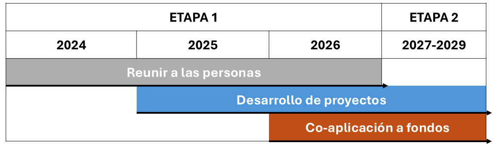
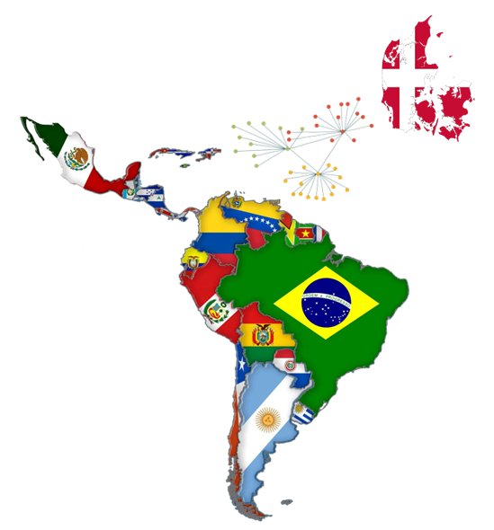

La primer etapa del proyecto de internacionalización está planeada para
implementarse en el transcurso de tres años: 2024-2026. Cada año
representa una fase del proyecto, con objetivos independientes y
actividades alineadas a ellos.

{fig-align="left"}

## Reunir a la gente

Esta fase del proyecto consiste en la realización de seminarios en línea
con el objetivo principal de crear y fortalecer la red SDCA-LATAM.
Además, queremos conocer y diseminar el tipo de investigación en
diabetes que se lleva a cabo en la región de América Latina, identificar
áreas potenciales de colaboración y conocer los intereses y necesidades
de investigación en diabetes en la región.

Desde la primavera de 2024 se han organizado estos seminarios de manera
mensual e involucrado a colegas con una gama de pérfiles diversos que se
encuentran en diferentes etapas de su trayectoría académica o clínica.
Gracias a la contribución de presentadores de diferentes países en la
región, incluyendo Argentina, México, Perú, Colombia, Costa Rica y
Brasil, estamos construyendo puentes al mismo tiempo que diseminamos el
conocimiento que se produce de manera local.

{fig-align="center"}

Accede a las presentaciones y las grabaciones en la pestaña de
seminarios.

## Desarrollo de proyectos

Conforme la red comenzó a tomar forma, las ideas comenzaron a surgir y
las oportunidades de colaboración a presentarse. Es por eso que en esta
fase del proyecto nos enfocamos en sentar las bases de estas
colaboraciones. Enmarcamos nuestras actividades académicas y de
investigación bajo la perspectiva de ciencia abierta y reproducibilidad.

```{=html}
<!-- explain here what is open science, reproducibility, and provide examples of current collaborations
Incidence of diabetes project, the repository perse, el curso con José Luis, the LatinDiab project-->
```

## Co-aplicación a fondos

A lo largo de estos tres años hemos sometido dos propuestas de
financiamiento. La primera a la Fundación Novo Nordisk Global Science
Summit Programme 2024 con el proyecto LatinDiab-1 y la segunda al Global
Innovation Network Programme de la Agencia de Educación Superior de
Dinamarca, con el objetivo de conformar una red de instituciones en
Dinamarca, México, Colombia, Perú y la Asociación Latinoamericana de
Diabetes. A pesar de no haber conseguido estos fondos, estos esfuerzos
nos han permitido fortalecer nuestros vínculos, refinar nuestras ideas
de proyectos.
<!--Aquí podmos subir los pdf's de las aplicaciones o redireccionar a la página de LatinDiab-->

## Otras actividades e iniciativas en la red

```{=html}
<!-- Aquí podemos mencionar los cursos que hemos realizado, las presentaciones,
los grupos de trabajo -->
```

## El camino a seguir 2027-2029

Cómo se evoluciona de ser una red a una comunidad? Queremos ser una
"comunidad" que investiga o acciona en la diabetes. Las actividades que
vamos a implementar buscan motivar y/o fortalecer el sentido de
pertenencia a la red, su valor, y la confianza entre los miembros. Al
mismo tiempo queremos poner en marcha proyectos de diabetes de alta
calidad y rigor científico.

Actividades: - Los seminarios en línea van a continuar con un formato a
demanda. Es decir que queremos seguir promoviendo ese espacio virtual de
difusión sincrónica pero ahora a demanda. Si algún miembro de la red
quisiera presentar los resultados de uno de sus proyectos, ese espacio
estaría a su disposición. (respetando los días-Miércoles- y horarios
establecidos (depende de la zona horaria).

- Grupo de estudio sobre GitHub. Queremos promover el uso de
  herramientas de libre acceso que permitan prácticas modernas de
  colaboración como el uso de sistemas de control de cambios. Existe
  mucho material disponible en la red sobre su uso, por lo que diseñar
  un curso es poco eficaz para el próposito de establecer proyectos
  colaborativos utilizando este tipo de herramientas. Un grupo de
  estudio consise en participantes que revisan material didáctico de
  manera independiente y asincrónica, luego coincide con un grupo de
  otros participantes para discutir de manera grupal el proceso de
  implementación del flujo de trabajo. Una vez estudiado y establecido
  este flujo de trabajo, se ejecutará un proyecto en grupos utilizando
  datos de libre acceso (ENSAEM, ENSANUT, ELSA, ENSA de Perú) y las
  herramientas para elaborar un proyecto sobre diabetes con un flujo de
  trabajo reproducible.

- News letter. Otra manera de conocer mejor el trabajo y las ambiciones
  de los miembros de la red, es mediante un news letter. El contenido
  del newsletter y la frecuencia con que se distribuya está abierto a
  discusión y definición. Queremos co-diseñar las actividades de la
  siguiente fase del proyecto, es por eso que se invulcren es importante
  para fortalecer nuestros vínculos!

- Collaborative write-ups.

- Funding applications
